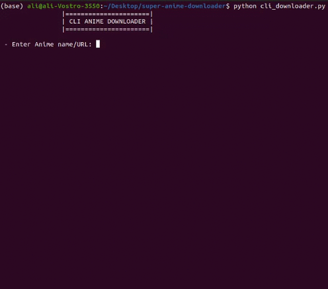

# !!! NOTE !!!
THE ANIME WEBSITE USED IN THIS PROJECT ( https://www2.gogoanime.sh/ ) IS NO LONGER AVAILABLE (at least in some countries). I'LL TRY TO FIND AN ALTERNATIVE SOON!

# super-anime-downloader
[](https://github.com/psf/black)

A console application written in Python3.x (GUI will be added soon) which takes a Anime Name/URL as input and downloads the range of episodes you specify.
- Video tutorial for PC: https://youtu.be/TV2X5ysJius
- Video tutorial for Android: https://youtu.be/-kSxlGcbmpw



# How to contribute? - Pull Requests

Contributors are welcome! Read [CONTRIBUTING.md](https://github.com/ali-sajjad-rizavi/super-anime-downloader/blob/master/CONTRIBUTING.md) for instructions how to contribute to this project.

# Supported Platforms:
- Windows 7/8/8.1/10
- Linux (Debian, Fedora, Arch etc.)
- MacOS
- Android (Using Termux: https://play.google.com/store/apps/details?id=com.termux )

# Instructions for Android:
- Install Termux ( https://play.google.com/store/apps/details?id=com.termux ).
- Open Termux and run the following commands to set things up:
```
pkg update
termux-setup-storage
pkg install python git aria2
pip install requests bs4
cd /sdcard
ls
git clone https://www.github.com/ali-sajjad-rizavi/super-anime-downloader
```
- Everytime you need to download Anime episodes, you must open Termux and run these commands:
```
cd /sdcard/super-anime-downloader
python cli_downloader.py
```
Enter anime name or URL and set the episode range. Anime folder containing downloaded episodes
will be present inside "Internal Storage -> super-anime-downloader ->".

# Instructions for Windows:
- Install Python3.x ( https://www.python.org/downloads/ , Also check mark `Add python to PATH`).
- Install packages needed:
```
python -m pip install -r requirements.txt
```
- Download zip file from https://github.com/ali-sajjad-rizavi/super-anime-downloader and extract the repository folder.
Go inside 'super-anime-downloader' folder and run 'cli_downloader.py' ('Open with Python').
OR
Open command-prompt inside the directory you want to download in, and run these commands:
```
git clone https://github.com/ali-sajjad-rizavi/super-anime-downloader
cd super-anime-downloader
python cli_downloader.py
```
- Download 'aria2c.exe' ( from https://aria2.github.io/ ) and place it in 'super-anime-downloader' folder.
Enter anime name or URL and set the episode range. Anime folder containing downloaded episodes
will be present inside "Internal Storage -> super-anime-downloader ->".

# Instructions for Linux:
Open terminal inyour desired folder and run:
```
sudo apt-get install aria2
sudo apt-get install git
sudo apt-get install python3.8
python3 -m pip install -r requirements.txt
git clone https://github.com/ali-sajjad-rizavi/super-anime-downloader
cd super-anime-downloader
python3 cli_downloader.py
```
Enter anime name or URL and set the episode range. Anime folder containing downloaded episodes
will be present inside "Internal Storage -> super-anime-downloader ->".

# HOW TO USE?
- Copy the link of the Anime you want to download and paste OR search by anime name. For now, this script only supports
the Anime links from GoGoAnime (See: https://www.gogoanime.io) but more websites support
will be added later.
- Provide the range of episodes you want to download.
- Downloaded anime folder will be present inside 'super-anime-downloader' folder.
Name of the folder will be the anime title on successfull completion. In case of any download failure, the folder name
will be 'downloaded'.

***PAUSE AN ONGOING DOWNLOAD:***
Press [Ctrl+C] to pause download. To exit, press [Ctrl+C] again.

***RESUME DOWNLOADS:***
Run program again, already downloaded episodes will not be downloaded again.
The episodes which are partially downloaded, will automatically resume from where they stopped.

# Note:
Please report ( at https://github.com/ali-sajjad-rizavi/super-anime-downloader/issues ) if you are facing any kind of issues
so that this tool can be further improved.

A similar project at https://github.com/ali-sajjad-rizavi/py-dramanice-downloader to batch download Asian Drama episodes.
